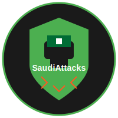
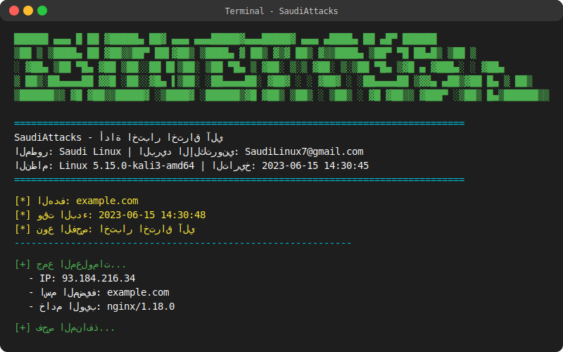

# SaudiAttacks

<p align="center">
  
</p>

<p align="center">
  <b>أداة اختبار اختراق آلي مكتوبة بلغة البايثون</b>
</p>

<p align="center">
  <a href="#الميزات-الرئيسية">الميزات</a> •
  <a href="#المتطلبات">المتطلبات</a> •
  <a href="#التثبيت">التثبيت</a> •
  <a href="#الاستخدام">الاستخدام</a> •
  <a href="#أمثلة">أمثلة</a> •
  <a href="#المساهمة">المساهمة</a> •
  <a href="#الترخيص">الترخيص</a>
</p>

## نظرة عامة

SaudiAttacks هي أداة شاملة لإدارة سطح الهجوم وتحديد الثغرات الأمنية في أنظمة الكمبيوتر والشبكات والتطبيقات. تم تصميمها لمساعدة مختبري الاختراق والمتخصصين في الأمن السيبراني على تقييم الأنظمة والشبكات بشكل آلي وفعال.

<p align="center">
  
  <br>
  <em>لقطة شاشة للأداة أثناء التشغيل</em>
</p>

## سير العمل

<p align="center">
  
  <br>
  <em>مخطط سير عمل أداة SaudiAttacks</em>
</p>

## الميزات الرئيسية

### جمع المعلومات
- استعلامات DNS (سجلات A، MX، NS، TXT)
- معلومات Whois
- تحليل الشبكة والمنافذ المفتوحة
- اكتشاف الخدمات والإصدارات
- جمع معلومات الويب والعناوين

### فحص المنافذ
- فحص المنافذ باستخدام Nmap
- اكتشاف المنافذ المفتوحة والخدمات
- تحديد إصدارات الخدمات
- اكتشاف نظام التشغيل

### فحص الثغرات الأمنية
- فحص الثغرات المعروفة (Heartbleed، Shellshock، POODLE، وغيرها)
- تحليل تكوينات SSL/TLS
- اكتشاف الخدمات المعرضة للخطر
- تحديد سوء التكوين الأمني

### فحص خادم الويب
- تحليل معلومات الخادم
- فحص رؤوس HTTP الأمنية
- اكتشاف الملفات والمجلدات الحساسة
- تحليل تكوينات CORS و CSP

### فحص أنظمة إدارة المحتوى
- اكتشاف وتحليل WordPress
  - تحديد المستخدمين
  - فحص الإضافات والقوالب
  - تحديد الثغرات المعروفة
- اكتشاف وتحليل Joomla
  - تحديد المكونات والإضافات
  - فحص القوالب
  - تحديد الثغرات المعروفة

### توليد التقارير
- تقارير HTML تفاعلية
- تقارير JSON للتكامل مع الأدوات الأخرى
- رسوم بيانية وإحصائيات
- تصنيف الثغرات حسب الخطورة

## المتطلبات

- Python 3.6+
- نظام لينكس (مدعوم بشكل كامل) أو ويندوز (دعم محدود)
- Nmap
- حزم بايثون إضافية (مذكورة في ملف requirements.txt)

## التثبيت

### التثبيت التلقائي (لينكس)

```bash
git clone https://github.com/SaudiLinux/SaudiAttacks.git
cd SaudiAttacks
chmod +x install.sh
sudo ./install.sh
```

### التثبيت اليدوي

```bash
git clone https://github.com/SaudiLinux/SaudiAttacks.git
cd SaudiAttacks
pip install -r requirements.txt
chmod +x saudi_attacks.py
```

### التثبيت باستخدام pip

```bash
pip install saudi-attacks
```

## الاستخدام

```
استخدام: saudi_attacks.py [-h] [-t TARGET | -f FILE] [-p] [-w] [--wordpress] [--joomla] [-v] [-a] [-o OUTPUT] [-q] [-d]

SaudiAttacks - أداة لإدارة سطح الهجوم واختبار الاختراق الآلي

الخيارات:
  -h, --help            عرض رسالة المساعدة هذه والخروج
  -t TARGET, --target TARGET
                        الهدف (عنوان IP أو اسم نطاق)
  -f FILE, --file FILE  ملف يحتوي على قائمة الأهداف
  -p, --port-scan       تنفيذ فحص المنافذ باستخدام Nmap
  -w, --web-scan        تنفيذ فحص خادم الويب وتطبيقات الويب
  --wordpress           تنفيذ فحص WordPress
  --joomla              تنفيذ فحص Joomla
  -v, --vuln-scan       تنفيذ فحص الثغرات الأمنية
  -a, --all             تنفيذ جميع عمليات الفحص
  -o OUTPUT, --output OUTPUT
                        اسم ملف التقرير (الافتراضي: تقرير بطابع زمني)
  -q, --quiet           وضع الصمت (عدم طباعة الرسائل)
  -d, --debug           وضع التصحيح (طباعة رسائل التصحيح)
```

## أمثلة

### فحص هدف واحد مع جميع عمليات الفحص

```bash
sudo python saudi_attacks.py -t example.com -a
```

### فحص المنافذ لعدة أهداف من ملف

```bash
sudo python saudi_attacks.py -f targets.txt -p
```

### فحص خادم الويب وتطبيقات الويب

```bash
sudo python saudi_attacks.py -t example.com -w
```

### فحص WordPress

```bash
sudo python saudi_attacks.py -t example.com --wordpress
```

### فحص الثغرات الأمنية وتحديد اسم ملف التقرير

```bash
sudo python saudi_attacks.py -t example.com -v -o report.html
```

## المساهمة

نرحب بالمساهمات! يرجى الاطلاع على [دليل المساهمة](CONTRIBUTING.md) للحصول على مزيد من المعلومات.

## الترخيص

هذا المشروع مرخص بموجب [ترخيص MIT](LICENSE).

## المطور

- **المبرمج**: Saudi Linux
- **البريد الإلكتروني**: SaudiLinux7@gmail.com

## إخلاء المسؤولية

هذه الأداة مخصصة للاستخدام في اختبار الاختراق الأخلاقي والقانوني فقط. المطور غير مسؤول عن أي استخدام غير قانوني لهذه الأداة. استخدم هذه الأداة فقط على الأنظمة التي لديك إذن صريح لاختبارها.