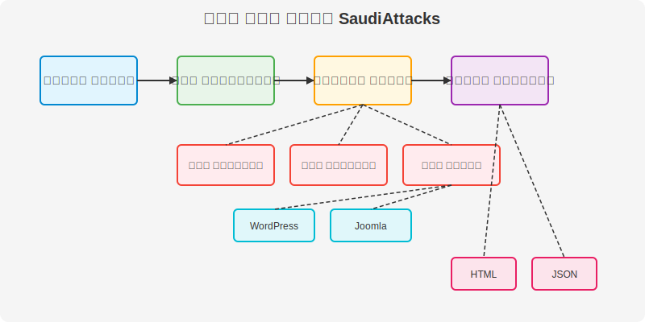

# وثائق أداة SaudiAttacks

مرحبًا بك في وثائق أداة SaudiAttacks، الأداة الشاملة للاختبار الأمني واكتشاف الثغرات. تم تصميم هذه الوثائق لمساعدتك على فهم واستخدام الأداة بشكل فعال.


## جدول المحتويات

### دليل المستخدم

- [نظرة عامة](../README.md) - نظرة عامة على الأداة وميزاتها الرئيسية
- [دليل التثبيت](../INSTALL.md) - تعليمات تفصيلية لتثبيت الأداة
- [دليل الاستخدام](usage.md) - كيفية استخدام الأداة وخياراتها المختلفة
- [أمثلة عملية](examples.md) - أمثلة تفصيلية لاستخدام الأداة في سيناريوهات مختلفة
- [الأسئلة الشائعة](faq.md) - إجابات على الأسئلة المتكررة
- [استكشاف الأخطاء وإصلاحها](troubleshooting.md) - حلول للمشكلات الشائعة
- [مسرد المصطلحات](glossary.md) - شرح للمصطلحات التقنية والأمنية المستخدمة

### دليل المطور

- [وثائق API](api.md) - توثيق واجهة برمجة التطبيقات
- [وحدات الأداة](modules.md) - شرح مفصل لوحدات الأداة المختلفة
- [دليل التطوير](development.md) - إرشادات للمطورين الذين يرغبون في المساهمة
- [استخدامات متقدمة](advanced.md) - تخصيص الأداة، تكاملها مع أدوات أخرى، واستراتيجيات الفحص المتقدمة

### معلومات المشروع

- [المساهمة](../CONTRIBUTING.md) - كيفية المساهمة في تطوير الأداة
- [مدونة قواعد السلوك](../CODE_OF_CONDUCT.md) - قواعد السلوك للمساهمين
- [سياسة الأمان](../SECURITY.md) - سياسة الإبلاغ عن الثغرات الأمنية
- [سجل التغييرات](../CHANGELOG.md) - سجل التغييرات والإصدارات
- [الترخيص](../LICENSE) - معلومات ترخيص المشروع

## نظرة عامة

SaudiAttacks هي أداة شاملة للاختبار الأمني واكتشاف الثغرات، مكتوبة بلغة Python. تهدف الأداة إلى أتمتة عمليات جمع المعلومات واختبار الاختراق وفحص الثغرات.

### الميزات الرئيسية

- **جمع المعلومات**: جمع معلومات مفصلة عن الهدف
- **فحص المنافذ**: اكتشاف المنافذ المفتوحة والخدمات النشطة
- **فحص الثغرات**: اكتشاف الثغرات الأمنية المحتملة
- **فحص خوادم الويب**: فحص خوادم الويب وتطبيقات الويب
- **فحص أنظمة إدارة المحتوى**: فحص أنظمة WordPress وJoomla
- **توليد التقارير**: إنشاء تقارير مفصلة بتنسيقات HTML وJSON

### تدفق العمل



## البدء السريع

### التثبيت

```bash
# تثبيت من GitHub
git clone https://github.com/SaudiLinux/Saudi-Attacks.git
cd Saudi-Attacks
pip install -r requirements.txt

# أو التثبيت باستخدام pip
pip install saudi-attacks
```

### الاستخدام الأساسي

```bash
# فحص شامل
python saudi_attacks.py example.com

# فحص منافذ محددة
python saudi_attacks.py example.com --scan-type port --ports 80,443,8080

# فحص تطبيقات الويب
python saudi_attacks.py example.com --scan-type web

# فحص نظام WordPress
python saudi_attacks.py example.com --scan-type wordpress

# توليد تقرير بتنسيق محدد
python saudi_attacks.py example.com --output report.html --format html
```

## المساهمة

nنرحب بمساهماتك! يرجى قراءة [دليل المساهمة](../CONTRIBUTING.md) للحصول على معلومات حول كيفية المساهمة في تطوير الأداة.

## الترخيص

هذا المشروع مرخص بموجب [رخصة MIT](../LICENSE).

## إخلاء المسؤولية

تم تطوير هذه الأداة لأغراض الاختبار الأمني الأخلاقي والقانوني فقط. يجب استخدامها فقط على الأنظمة التي لديك إذن صريح لاختبارها. المطورون غير مسؤولين عن أي استخدام غير قانوني أو غير أخلاقي للأداة.